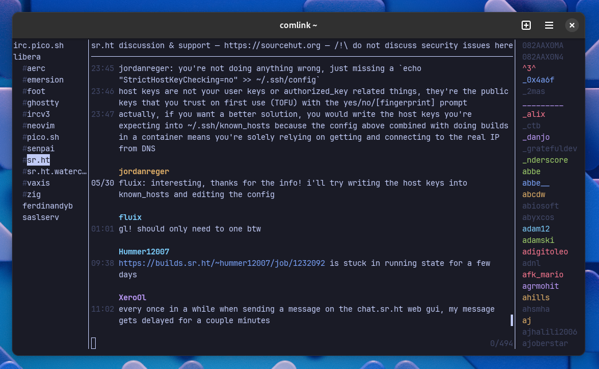

# comlink

An experimental IRC client written in zig



## Configuration

Configuration is loaded from `$HOME/.config/comlink/init.lua`

Works best with `soju`

```zig
local comlink = require("comlink")

local config = {
	server = "chat.sr.ht",
	user = "rockorager",
	nick = "rockorager",
	password = "password",
	real_name = "Tim Culverhouse",
	tls = true,
}

comlink.connect(config)
```
